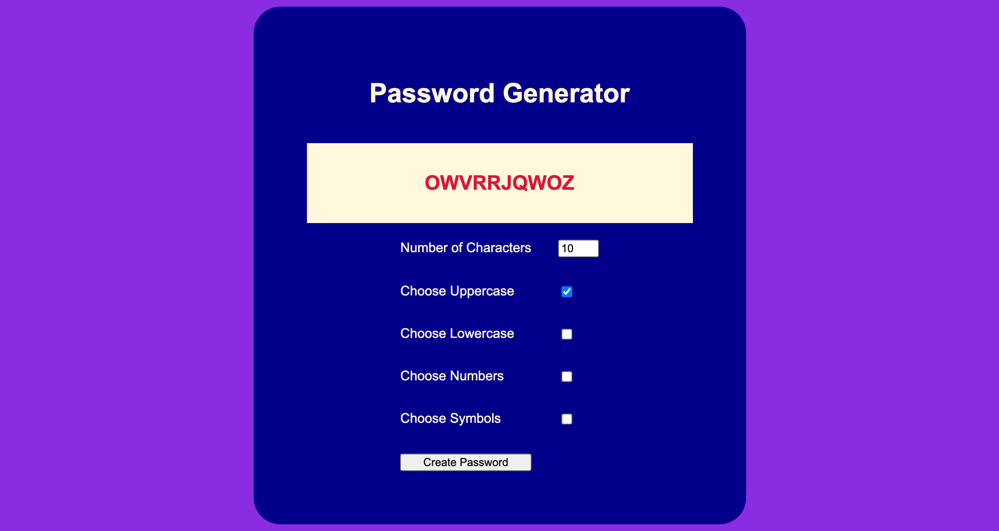

# Password-maker
The assignment given to us for this week was to build a random password generator focusing on the skills we learned throughout the week. Using all the skills we learned throughout the week and combining what I learned from our weeks with html and css I was able to get the random password generator to work. I started off by building the html first and adding a container with multiple other elements then moved into the css aspect to design it the way I felt would look best. During the css part I used different color combinations and various designs to get the final product of how the random password generator should look.

Within the html I structured everything to be as neat as possible and able to read for others if need be. I focused on the material I have learrned so far to create a proper structure for the html.

Moving onto the css it took me a while to get what I truly wanted, such as colors and font sizes, along with many more details. However, after I went through various selections, I was able to find and use everything that I wanted to design the webpage and randoom password generator to my liking. The css was something I enjoyed working on the most, it allowed me to create the random password generator the way I wanted with the designing aspect, I personally feel people who would use it would enjoy the work put into the css aspect as well.

The javascript was the hardest section for me to work on due to getting the entire program to work properly, however once I started getting the program to work more of the script came naturally and slowly started making more sense as I progressed forward. 

Link to github: https://aakash52297.github.io/Password-maker/.

